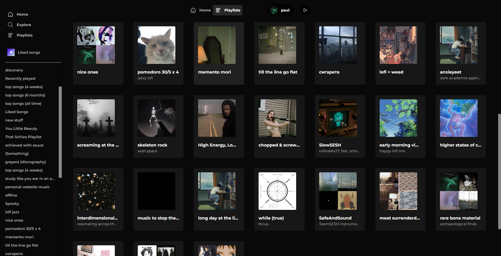

 </img>

# topsongs.me

> Self-updating Spotify playlists of your Top Songs, Likes and History (WIP)

## Features
- Spotify-like User interface
- Playlist generation
    - Most streamed songs (4 weeks, 6 months, All time)
    - History (Last 50 played songs)
    - Liked Songs
- Node backend for continuously updating the playlists

### Built with

- [Spotify Web API](https://developer.spotify.com/documentation/web-api/reference/#/)
- [TypeScript](https://www.typescriptlang.org/)
- [Next.js](https://nextjs.org/) [currently migrating to next13's new server components]
- [tRPC](https://trpc.io/) [refactoring in progress]
- [Prisma](https://prisma.io/)
- [PlanetScale](https://planetscale.com/)
- [NextAuth](https://next-auth.js.org/)
- [TailwindCSS](https://tailwindcss.com/)
- [Plausible Analytics](https://plausible.io)

## Structure

    .
    ├── prisma                      # prisma database schema
    ├── public                      # public assets (static images)
    ├── src
        ├── context                 # react context wrappers
        ├── modules
            ├── app                 # app components
            ├── landing             # landing page components
        ├── pages
            ├── album               # album page
            ├── api
                ├── auth            # NextAuth logic
            ├── artist              # artist page
            ├── collection
            ├── playlist            # playlist page
        ├── styles                  # css styling
        ├── types                   # custom types
        └── utils                   # utility functions

## Setup

### Spotify API

- [Sign up for a Spotify developer account](https://developer.spotify.com/dashboard)
- Create a new application
- Add `http://localhost:3000/api/auth/callback/spotify` as Redirect URI
- Copy `Client ID` and `Client Secret`

### PlanetScale DB

- [Sign up for PlanetScale](https://auth.planetscale.com/sign-up)
- Create a new database
- Click on `Connect` and copy the `DATABASE_URL='mysql...'` value

### Develop locally

```bash
git clone https://github.com/paulphys/topsongs.me
cd topsongs.me
yarn
yarn dev
```

### Environment variables

Create a `.env` file similar to [`.env.example`](https://github.com/paulphys/topsongs.me/blob/main/.env.example) in the root of the application and fill in all values.

### Deploy to Vercel ▲

[](https://vercel.com/new/git/external?repository-url=https%3A%2F%2Fgithub.com%2Fpaulphys%2Ftopsongs.me)

Add all [Environment Variables](https://vercel.com/docs/environment-variables) from [`.env.example`](https://github.com/paulphys/topsongs.me/blob/main/.env.example) to the production build.

Within the Spotify Dashboard, configure your application with new public `Redirect URI`.
